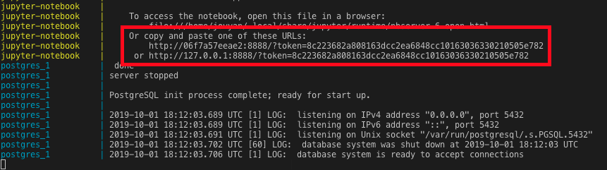

# Welcome

This project has been created to explore working with [Jupyter](https://jupyter.org/index.html) notebooks and related offerings.


Anything you create within the Jupyter interface will be stored in the `notebooks` folder. This means you might have to update `.gitignore` to exclude temporary files that are not currently listed.

All of your saved notebooks will be persisted. There is an optional PostgreSQL server that is created in case you want to use a back-end database for processing. Just be warned that data IS NOT PERSISTED in the database unless you modify the `docker-compose.yml` file to explicitly do so.

## Getting started

The easiest way to use this repo is to have [Docker Desktop for Mac/Windows](https://www.docker.com/products/docker-desktop) installed and configured on your development machine.

Once this is complete, you can spin up the project by running:

```sh
# Spin up a local Docker environment
$ npm start
```

When you load the project for the first time, it may take twelve minutes or so to build - the created image with all of the relevant dependencies weighs in a a hefty ~6.48 GB.




To work with Jupyter, click on the URL - which will look something like [http://127.0.0.1:8888/?token=94117cd90212b32e70767d7b1d1dbf594521ed6f03ce8989](http://127.0.0.1:8888/?token=94117cd90212b32e70767d7b1d1dbf594521ed6f03ce8989) in your terminal.

Once you have finished, simply press `CTRL + C` to stop all of the containers from running. Alternatively, you can run `npm run docker:down` from the command line.

## Resources

[Jupyter Data Science Stack + Docker in under 15 minutes](https://towardsdatascience.com/jupyter-data-science-stack-docker-in-under-15-minutes-19d8f822bd45) - This article was the inspiration behind creating this repo.

[Jupyter Notebook Tutorial: The Definitive Guide](https://www.datacamp.com/community/tutorials/tutorial-jupyter-notebook) - Highly recommended if you're just dipping your toes into the world of Jupyter.

[Python Data Science Handbook](https://github.com/jakevdp/PythonDataScienceHandbook) - This free book (available for purchase) and sample repos are a great way to get started working with Python and Jupyter notebooks.


[matplotlib - 2D and 3D plotting in Python](https://nbviewer.jupyter.org/github/jrjohansson/scientific-python-lectures/blob/master/Lecture-4-Matplotlib.ipynb) - Excellent resource to visually skim some possibilities mapping and plotting data.

[Docker Compose for Data Science](https://www.andrewmahon.info/blog/docker-compose-data-science) - This is the resource that inspired building upon our original Docker setup.

[Deploying a Containerized JupyterHub Server with Docker](https://opendreamkit.org/2018/10/17/jupyterhub-docker/) - If you are looking to deploy JupyterHub using Docker containers, take a look at this guide.
